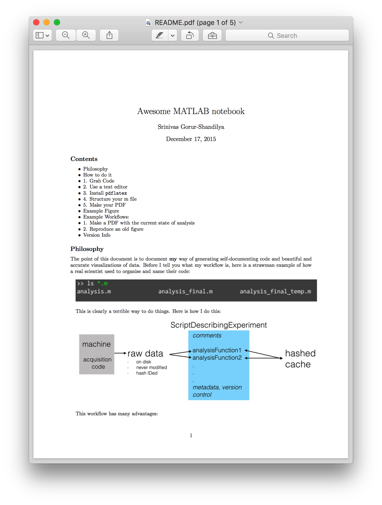
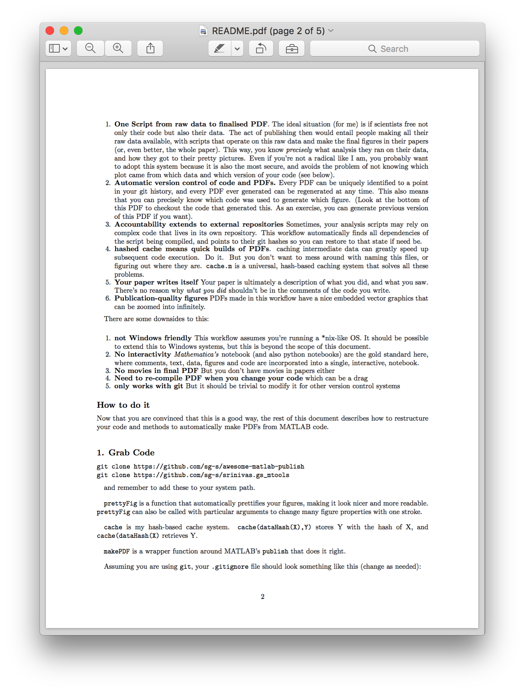
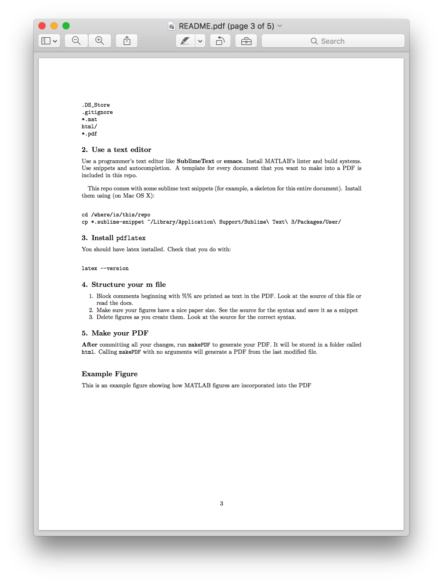
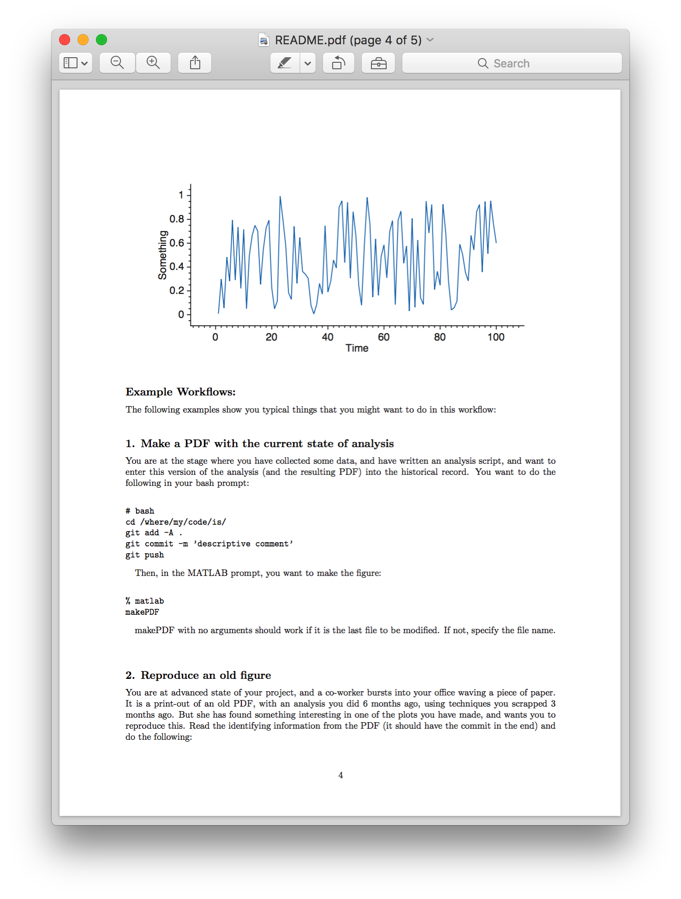
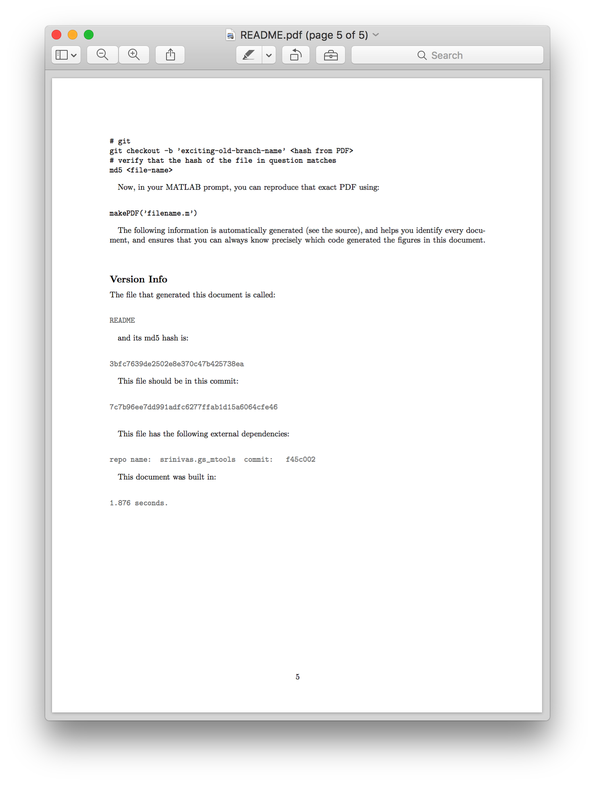

# awesome matlab notebook

This is the output of my workflow to generate PDFs from MATLAB code. You can also download the PDF [here](https://github.com/sg-s/awesome-matlab-notebook/releases).

## Troubleshooting 

### The static images don't show! 

Static images are referred to using absolute paths. You should change the paths in `README.m` to point to the correct files. 

### I get an error saying something "libstdc++.so.6"

This is a bug in MATLAB. See [this](https://www.mathworks.com/matlabcentral/answers/329796-issue-with-libstdc-so-6) for a workaround. (Briefly, you have to force MATLAB to use the system libstdc++ instead of the crappy one included with MATLAB). 